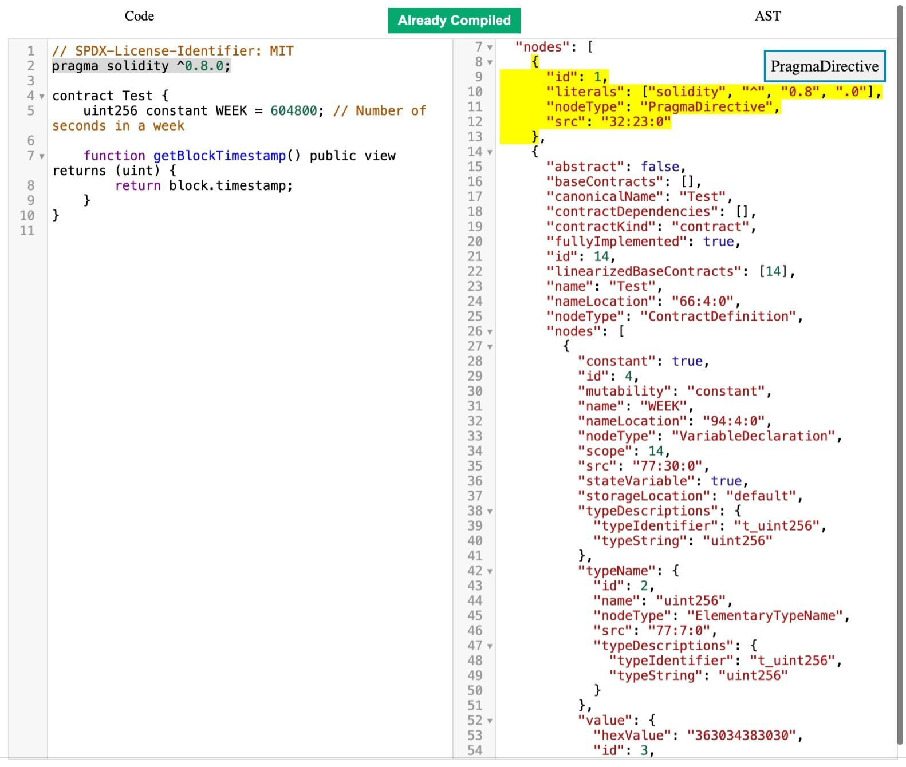

# AST Generator
This project takes a solidity code and generates the AST of it.

### Features
- Highlight AST code for any selected solidity code
- Traversed tree path is shown
- Tree is pinnable, helps to visually differentiate between two trees

Run the project: `npm run dev`

Build the project: `npm run build`
